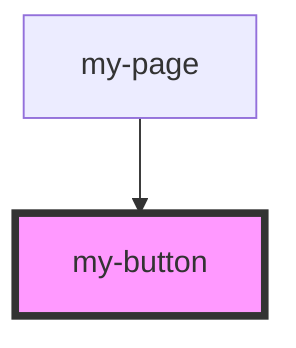

# my-button

<!-- Auto Generated Below -->

## Properties

| Property   | Attribute  | Description | Type                                     | Default     |
| ---------- | ---------- | ----------- | ---------------------------------------- | ----------- |
| `disabled` | `disabled` |             | `boolean`                                | `false`     |
| `label`    | `label`    |             | `string`                                 | `undefined` |
| `size`     | `size`     |             | `"large" \| "small"`                     | `'large'`   |
| `variant`  | `variant`  |             | `"primary" \| "secondary" \| "tertiary"` | `'primary'` |

## Events

| Event           | Description | Type               |
| --------------- | ----------- | ------------------ |
| `buttonClicked` |             | `CustomEvent<any>` |

## Dependencies

### Used by

 - [my-page](../my-page)

### Graph

----------------------------------------------

*Built with [StencilJS](https://stenciljs.com/)*
