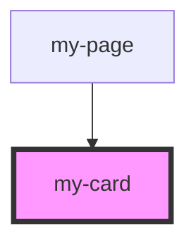

# my-card

<!-- Auto Generated Below -->

## Properties

| Property   | Attribute  | Description             | Type      | Default     |
| ---------- | ---------- | ----------------------- | --------- | ----------- |
| `bgshadow` | `bgshadow` | 是否有阴影                   | `boolean` | `true`      |
| `label`    | `label`    | 可选属性 卡片标签               | `string`  | `''`        |
| `rel`      | `rel`      | 可选属性 卡片引用 {string}      | `string`  | `''`        |
| `styles`   | `styles`   | 可选属性 可注入的CSS样式 {string} | `string`  | `undefined` |
| `target`   | `target`   | 可选属性 可链接卡片的目标 {string}  | `string`  | `''`        |
| `to`       | `to`       | (optional) Link card    | `string`  | `''`        |

## Shadow Parts

| Part       | Description |
| ---------- | ----------- |
| `"body"`   |             |
| `"border"` |             |

## Dependencies

### Used by

 - [my-page](../my-page)

### Graph

----------------------------------------------

*Built with [StencilJS](https://stenciljs.com/)*
